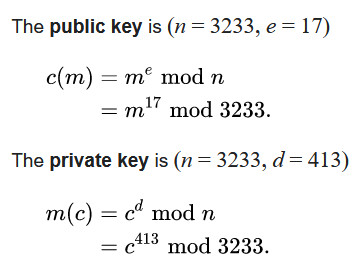

# miniRSA

The file we get has three components to it: `N`, `e` and `c`. Reading through [RSA's wikipedia page](https://en.wikipedia.org/wiki/RSA_(cryptosystem))
we can see that it is defined as:

    

The wiki page also says that `e = 3` is the smallest possible value that will work for RSA, but will
also affect security. Maybe we could bruteforce this?

We can essentially see that

    c = m ^ e % n

Which means if `m ^ e < n`, the remainder is just `m ^ e`, which means `m = c ^ (1/e)`.

Calculating an accurate cube root and converting it into ASCII, we get our flag: `????????`
