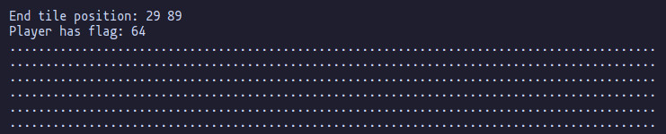
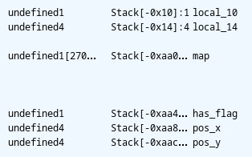

# babygame01

This one is a bit tricky! So in babygame, we're put into this "interactive" game environment, where
there's a map and the goal seems to be to get our little `@` character to the end of the map.

<p align="center">
    
</p>

We can move around with WASD. The hint on PicoCTF indicates that there are other "secret" commands that
do helpful stuff too. After fiddling around for a bit I found two of these commands:

    l - change character sprite
    p - win the game

Again, here I'll include my solution process since I found this challenge quite interesting. You
can skip to the solution [here](#solution).

## Solution Process

I thought this could be another input related string exploit (it's not), so I tried and got those
out of the way. Another thought that immediately came to mind was what happens if you move out of
bounds of the map. Moving towards the left and right boundaries just jumps you over to the other side,
while moving up and down just seems to glitch out the character position and doesn't show anything
on the map.

<p align="center">
    
</p>

This seemed to be in the right direction, so I figured if I could get the program to segfault I could
dump the stack somehow. This led to trying a lot of (random) things none of which worked. I gave up
after that and decided to revisit the problem later.

Later came by and my novel approach was to decompile the program entirely. I threw it into [ghidra]
and began analyzing. You can (and should) analyze it yourself if you're attempting the challenge
but here's the boiled down version.

I cleaned up some variables and determined these are the important parts. The map and player position
are defined as such:

```c
  int pos_y;
  int pos_x;
  char has_flag;
  undefined map [2700]
```

`has_flag` determines the win condition at the end of the gameloop, which looks like:

```c
  if (has_flag != 0) {
    puts("flage");
    win(); // prints the flag
    fflush(_stdout);
  }
```

So our goal is essentially to modify `has_flag` somehow to any value. Since `has_flag` itself is not
referenced anywhere in the gameloop or initialization, we'll need to do it in a roundabout way.

One way we could do this is by changing the value of `has_flag` when we're changing the value
of `pos` or `map` instead! Reading through the gameloop, the only function that mutates both of those
values is `move_player`.

```c
void move_player(int *position,char input_key,int map)

{
  int iVar1;

  if (input_key == 'l') {
    iVar1 = getchar();
    player_tile = (undefined)iVar1;
  }
  if (input_key == 'p') {
    solve_round(map,position);
  }
  *(undefined *)(*position * 90 + map + position[1]) = '.';
  if (input_key == 'w') {
    *position = *position + -1;
  }
  else if (input_key == 's') {
    *position = *position + 1;
  }
  else if (input_key == 'a') {
    position[1] = position[1] + -1;
  }
  else if (input_key == 'd') {
    position[1] = position[1] + 1;
  }
  *(undefined *)(*position * 90 + map + position[1]) = player_tile;
  return;
}
```

We can see that we can't easily modify `position`, so we'll have to work with `map`. The second
last line is what seems relevant to us. The line is a bit obscure to immediately understand; what's
more clear is that it's changing the new position on the map to the player sprite. How it does this
is by calculating an offset from the `map`'s beginning

    map[0] + position_x + (position_y * 90)

It's a little weird since `map` appears to be an integer, but it's actually just the address of `map`
cast as an integer. It seems suspicious that C would do do this auto-cast but I wrote some code to verify
and apparently it does

```c
    int x[2] = { 10, 20 };
    printf("%p\n", &x[0]);
    printf("0x%lx\n", (long int)(x)); // equal
```

Either way, now we know we just need to get the player's `x` position to some negative value to change
the value of `has_flag` instead!

```c
int[2]    position
int       has_flag
int[2700] map

attack addr -> &map - (sizeof)(int)
            -> &map - 4

write addr  -> (y_pos * 90) + &map + x_pos
            -> &map + x_pos // y_pos = 0
            -> x_pos = -4 !!

```

If you've done this challenge, you should know that this logic is wrong. But this seemed to line up
with some other writeups I read on this challenge, and trying it out, it does work!

<p align="center">
    
</p>

That's all you need to know the solve the challenge!

It still left me wondering though, why does the negative offset have to be `4` specifically? If
`has_flag` was an `int` and it was laid out right next to `map` in memory, you would still only need
a `-1` offset to change it. Again I wrote some code to verify that this was true, and it was

```c
    int x[2] = { 10, 20 };
    int* y = &x[1];

    printf("%p\n", y);  // 0x...934
    printf("%d\n", *y); // 20

    y = (int*)( (long int)y - 1 );
    *(unsigned char*)(y) = 30;
    y = (int*)( (long int)y - 3 );

    printf("%p\n", y);  // 0x...930
    printf("%d\n", *y); // gibberish
```

That's when I realized my calculation was wrong. `has_flag` is a `char`, not an `int` which is `1`
byte as opposed to `4`. So obviously there was something up with the stack layout. Taking another
look at ghidra:

<p align="center">
    
</p>

The addresses w.r.t the stack pointer is given as:

```c
map      -> -0xaa0 = -2720
has_flag -> -0xaa4 = -2724
```

Which is a `4` byte difference! This is probably just due to the alignment of `char` or map.

## Solution

Decompiling the binary through [ghidra], we can determine the stack layout as:

```c
int[2]    position
char      has_flag
int[2700] map
```

`has_flag` is the win condition to print our flag. We just need to modify `map` somehow that it
underflows and changes `has_flag`. The only way we can do this is through `move_player` in the
gameloop.

In `move_player`, we see that `map` is modified by taking the position offset with respect to its
address.

    map[0] + position_x + (position_y * 90)

So setting `position_x` to a negative value should affect `has_value`. We can determine the relative
locations of each of the variable's through ghidra's disassembly.

```c
map      -> -0xaa0 = -2720
has_flag -> -0xaa4 = -2724
```

Which means we just need a negative offset of `4` on our x-position! Testing this out:

<p align="center">
    
</p>

[ghidra]: https://github.com/NationalSecurityAgency/ghidra/
