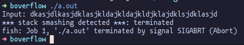
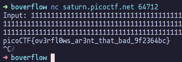

# Buffer Overflow 0

In this challenge, we somehow get the flag by overflowing some specific buffer as indicated by the
challenge description.

Reading through the source file, we see that the flag is read from some file and stored in memory.
We can also see a `SIGSEV` handler which outputs the flag.

```c
void sigsegv_handler(int sig) {
  printf("%s\n", flag);
  fflush(stdout);
  exit(1);
}
```

So our goal is to cause a segmentation fault.

Blindly trying to overflow the second buffer doesn't fetch us good results:

<p align="center">
    
</p>

This causes `SIGABRT`, we need `SIGSEV`. Overflowing the first buffer instead:

<p align="center">
    
</p>
