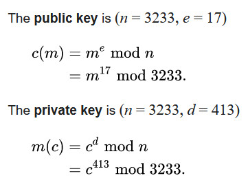

# miniRSA

The file we get has three components to it: `N`, `e` and `c`. Reading through [RSA's wikipedia page](https://en.wikipedia.org/wiki/RSA_(cryptosystem))
we can see that it is defined as:

<p align="center">
    
</p>

The wiki page also says that `e = 3` is the smallest possible value that will work for RSA, but will
also affect security. Maybe we could bruteforce this?

We can essentially see that

    c = m ^ e % n

Which means if `m ^ e < n`, the remainder is just `m ^ e`, which means `m = c ^ (1/e)`.

I wrote this Rust program to calculate the 3rd root of `c`.

```rust
use num::bigint::BigUint;

fn main() {
    let big_num = b"...";

    let big_num = BigUint::parse_bytes(big_num, 10).unwrap();

    println!("{:x}", big_num.nth_root(3));
}
```

And threw it into Python.

```py
bytearray.fromhex("...")
```

Which gave me my flag `picoCTF{n33d_a_lArg3r_e_d0cd6eae}`.
