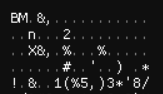
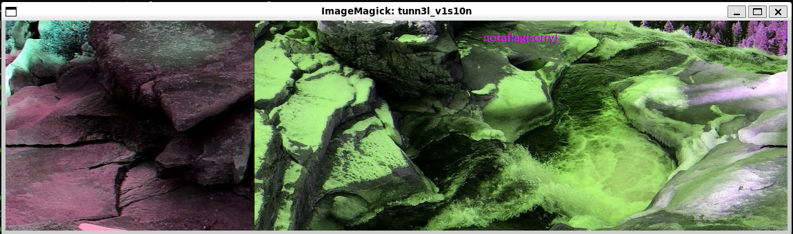
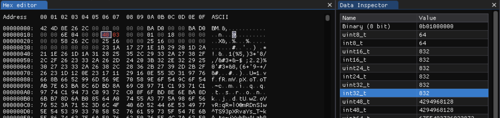
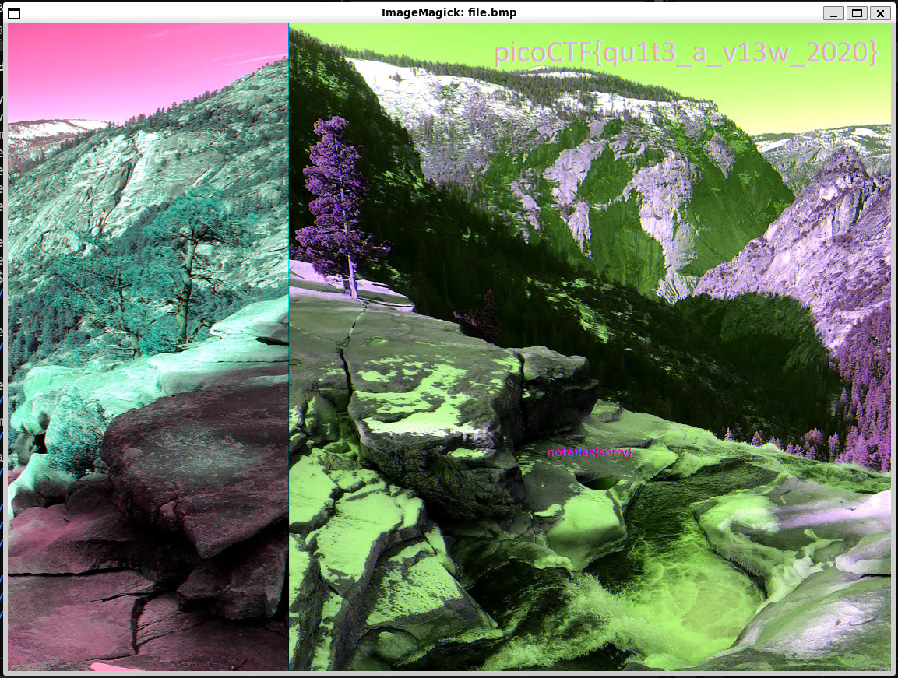

# tunn3l v1s10n

Taking a look at the hexdump of the downloaded file, we see two starting bytes that indicate the file
is a bitmap file.

    

Opening the file with ImageMagick, we see a disappointing message.

    

Looking at the hint of the challenge, the data section of the bitmap file seems far too large
for what is actually being displayed. We can read through the [bitmap format spec](https://www.ece.ualberta.ca/~elliott/ee552/studentAppNotes/2003_w/misc/bmp_file_format/bmp_file_format.htm)
and determine that the dimensions of the image are specified independently in the header. Perhaps
we could try resizing it manually?

Resizing the height of the image to 832 (through trial and error), we can finally see the enough
of the image to give us our flag.

    

    

