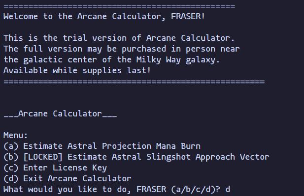
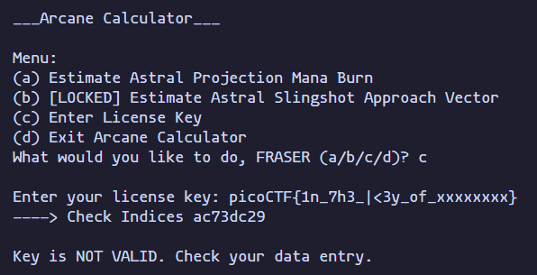

# keygenme-py

[`keygenme-py`](https://play.picoctf.org/practice/challenge/121?category=3&page=1) is the second
challenge in PicoCTF's reverse engineering practice category. The description provides a python
script and nothing else. The goal is to capture the flag.

The script itself has a dependency on [`cryptography`](https://pypi.org/project/cryptography/).
Installing and running, we see the following output.

<p align="center">
    
</p>

Reading through the source code, there's a very obvious snippet that hints at the flag.

```py
key_part_static1_trial = "picoCTF{1n_7h3_|<3y_of_"
key_part_dynamic1_trial = "xxxxxxxx"
key_part_static2_trial = "}"
key_full_template_trial = key_part_static1_trial + key_part_dynamic1_trial + key_part_static2_trial
```

The key template is checked against in the license key validation function. Reading the function,
we can see that the key needs to begin with `key_part_static1_trial`. The rest of the key is checked
against some combination of a hash. To find the final flag, we just need to figure out what combination
the code is checking against. We can hijack the function and insert our own code at the beginning of
the validation.

```py
        i = 0
        for c in key_part_static1_trial:
            if key[i] != c:
                return False

            i += 1

        # + Added
        hash = hashlib.sha256(username_trial).hexdigest()
        check_idx = hash[4] + hash[5] + hash[3] + hash[6] + hash[2] + hash[7] + hash[1] + hash[8]
        print(f"----> Check Indices {check_idx}")
        # + + + +

        # ...
```

Running the script:

<p align="center">
    
</p>

Which is the "dynamic" part of the key! Hence we have our flag `picoCTF{1n_7h3_|<3y_of_ac73dc29}`.
