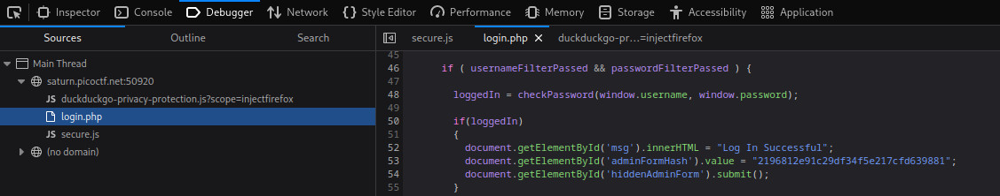
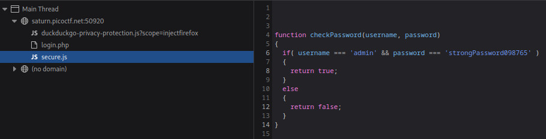

# Local Authority

We can enter some random username and password into the provided form. This redirects us to the
`/login.php` page. Looking at the source through the debugger we see:

    

Checking out the `secure.js` file, we see a very simple function:

    

Logging in with these credentials, we get our flag `picoCTF{j5_15_7r4n5p4r3n7_05df90c8}`.
