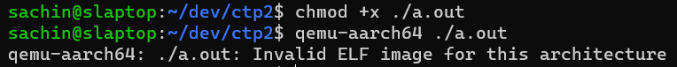
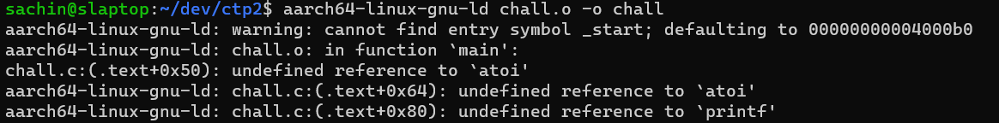
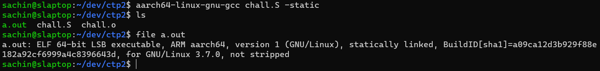
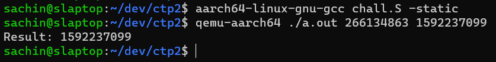

# ARMssembly 0

Reading through the description of [ARMssembly](https://play.picoctf.org/practice/challenge/160?category=3&page=1),
we get an ARM assembly file that's supposed to output a number given some arguments. This number will
make up our flag.

## Solution Process

(skip to [Solution](#solution))

I think the intended approach for this challenge might be to decompile the assembly file since well
the challenge is listed under "Reverse Engineering". But the most straightforward solution I could
think of was to execute the code through an emulator. I spun up my WSL instance for this. I had some
`aarch64` binutils previously installed so I tried just manually using those.

```sh
$ aarch64-linux-gnu-as chall.S
```

Which gave me an `a.out` file. This seemed promising, so I tried naively running it with `qemu-user`.

<p align="center">
    
</p>

QEMU interestingly enough, gives us an "Invalid ELF image" error. I'm not sure why that is the case,
other than the obvious step I missed which is to link the program (I'll get to that). Maybe something
about the ELF format that indicates it is not a proper executable yet? Or is it just because QEMU could not
find the `_start` symbol?

I tried to circumvent the ELF error by invoking `ld`.

<p align="center">
    
</p>

In hindsight it was obvious that this would also fail, since I haven't linked glibc for `aarch64`.
At this point, I just installed the whole GCC toolchain for `aarch64` and compiled it directly.

<p align="center">
    
</p>

The `-static` flag is necessary since otherwise it would dynamically try to load libc, which causes
QEMU to throw the "Invalid ELF image" error again. This further reinforces the lack of a `_start`
theory.

Either way, it was interesting to me that QEMU gave me an ELF error and not an "undefined reference"
or something that should indicate a missing symbol. I couldn't find any relevant documentation online
either so I decided to include this "solution process" section in the writeup.

## Solution

We can simply cross-compile the assembly file for ARM and run it through an emulator. In this case,
I grabbed the GCC ARM toolchain (`gcc-aarch64-linux-gnu`) and `qemu-user` and compiled the program.

<p align="center">
    
</p>

Converting the resulting number to hex we get `5ee79c2b`, which gives us our flag `picoCTF{5ee79c2b}`.
