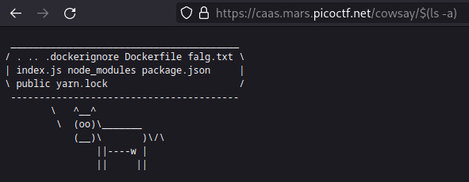
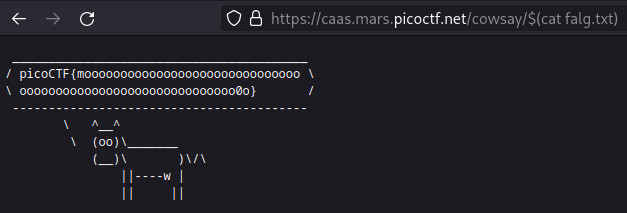

# CaaS

A relatively simple challenge as well. Reading through the script, we can see how the service works

```js
app.get('/cowsay/:message', (req, res) => {
  exec(`/usr/games/cowsay ${req.params.message}`, {timeout: ...}, (error, stdout) => {
    ...
  });
});
```

This will be easy to exploit, since the endpoint just passes whatever input we give it directly into
`exec`. Now, `exec` just spawns a shell and executes the command through the shell, so we can cleverly
insert shell arguments.

<p align="center">
    
</p>

Now we know what file we need to target, `cat`ing:

<p align="center">
    
</p>

Which is our flag!
